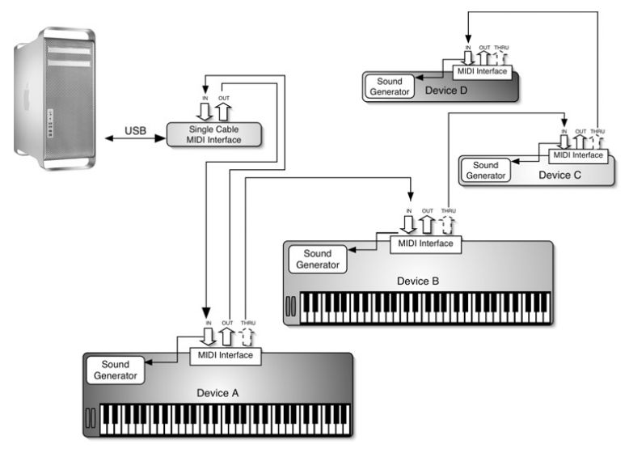
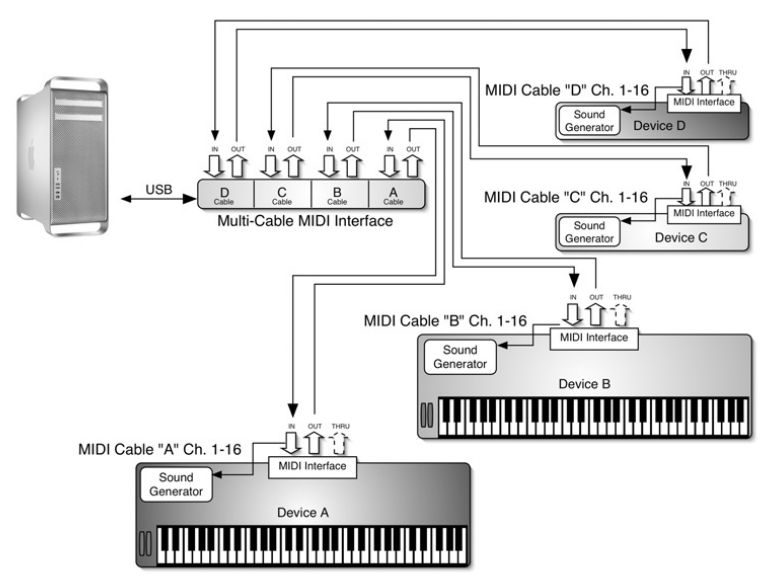

# Lesson 1: MIDI Sequencing

- MIDI messages
- Sequencing
- The Transport
- The Arrange Window
- Menus and Transport Display
- Getting Ready to Record
- Bars, Beats, and Subdivisions
- Metronome Settings
- MIDI Recording
- Record Modes: Replace and Overdub
- Loop Recording
- Step Recording
- Standard MIDI files

MIDI (Musical Instrument Digital Interface)

## Review of the MIDI standard

- allow keyboards and synthesizers from different companies to interact with each other
- based on 16 independent channels
- MIDI messages do not contain any information about audio
- the sequencer send the notes to the synthesizers and sound modules connected to the MIDI system to play, like to the  paper score
- Every device must have a MIDI interface. The MIDI standard uses three ports to control the data flow: IN, OUT, and THRU

- two main MIDI configurations: daisy-chain (DC) or start network (SN)

__Midi Chain network__

__Midi Star network__

## MIDI messages

__System messages:__

- System real-time:
  - timing clock
  - start, 
  - stop,
  - continue, 
  - active sensing, 
  - system reset
- System common: 
  - MTC, 
  - Song position pointer,
  - song select, 
  - tune request, 
  - end of SysEx
- System exclusive

__Channel messages:__

- Channel voice: 
  - Note on, 
  - Note off, 
  - Monophonic aftertouch, 
  - Polyphonic aftertouch, 
  - Control changes, 
  - Pitch bend, 
  - Program change
- Channel mode: 
  - All notes off, 
  - Local control (on/off), 
  - Poly on/mono on, 
  - Omni on, 
  - Omni off, 
  - All sound off, 
  - Reset all controllers  

### Channel voice messages

Channel voice messages carry information about the performance; for example, which notes we played and how hard we pressed the trigger on the controller.

__Note on__  
This message is sent every time you press a key on a MIDI controller. includes information:
- note pressed (ranges from 0 to 127 or C2 to G8)
- MIDI channel (1–16)
- velocity (how hard you press the key, from 0 to 127, 0 - silence)

__Note off__  
message is sent when you release the key of the controller
- note released (ranges from 0 to 127 or C2 to G8)
- MIDI channel (1–16)
- velocity (how hard you released the key, from 0 to 127, 0 - silence)

__Aftertouch__  
message that is sent after the (Note On) message. If you push a little bit harder on the key after hitting it, an extra message, called Aftertouch, is sent to the MIDI OUT. The Aftertouch message is usually assigned to control the vibrato effect of a sound, but  it can
also affect other parameters, such as volume, pan, and more.
- Monophonic aftertouch. affects the entire range of the keyboard no matter which key or keys triggered it.
- Polyphonic aftertouch. allows you to send an independent message for each key. It is more flexible

__Pitch bend__  
pitch-bend wheel on a keyboard controller. It allows you to raise or lower the pitch of the notes being played. range > 128 steps, from 0 to 16,383. 

__Control changes__  
synthesizer has a series of programs (also called patches, presets, instruments or, more generically, sounds) stored in its internal memory. for each MIDI channel we need to assign a patch that will play back. range of this message is 0 to 127. synthesizers can store many more than 128 sounds, nowadays programs are organized into banks , where each bank stores a maximum of 128 patches. necessary to combine a bank change message and a program change message. Most devices use CC#0 or CC#32 to change bank.

__Program change (CC)__  
allow you to control certain parameters of a MIDI channel.  There are 128 CCs (0–127); that is, the range of each controller extends from 0 to 127.  
the most important of these:
- CC#1  modulation, activated by moving the modulation wheel (a slow vibrato effect)
- CC#7  volume of a MIDI channel from 0 to 127
- CC#10 pan, Value 0 is pan hard left, 127 is hard right and 64 is centered.
- CC#64 sustain pedal (the notes played are held until the pedal is released). on (values ? 64) and off (values ? 63). p.9

