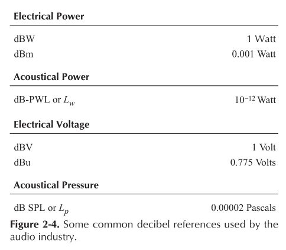
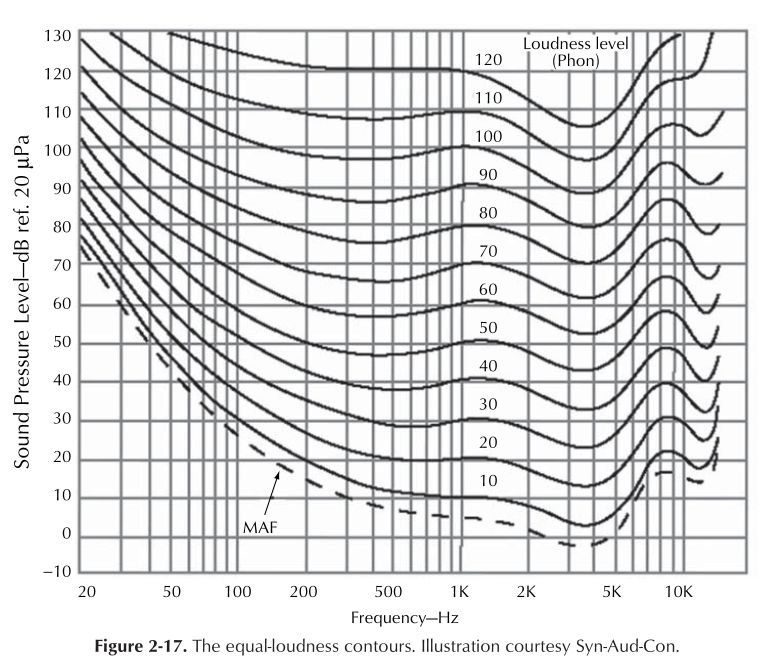
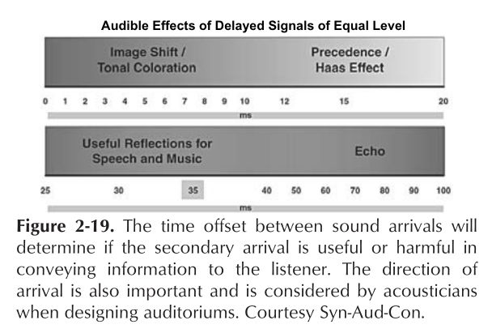

# Lesson 2: Sound and Signals

- Sound propagation
- Sound properties
- Decibels
- dB - SPL
- dB Reference Scales: dBu, dBV
- Operating levels: +4dB, -10-dB
- Mic Levels
- Balanced vs Unbalanced
- Analog Connectors
- Audio Specifications
- Noise Floor
- Signal to Noise Ratio
- Frequency Bandwidth
- Frequency Response
- Distortion
- Head Room
- Dynamic Range
- Studio Set-Up

## The Sine Wave

The weight in picture moves in what is called simple harmonic motion. Vibration or oscillation is possible because 
of the elasticity of the spring and the inertia of the weight. 

__Propagation of Sound__

The speed of sound in air is about 1,240 km/hr at normal temperature and pressure.

the pressure at the crests is higher than the prevailing atmospheric barometric pressure and the troughs lower than the atmospheric pressure, as shown in the sine wave of picture. These fluctuations of pressure are very small indeed. The faintest sound the ear can hear (20 μPa) exists at a pressure some 5,000 million times smaller than atmospheric pressure. Normal speech and music signals are represented by correspondingly small ripples superimposed on the atmospheric pressure.

## Waves

### Wavelength and Frequency

A sine wave is illustrated

Wavelength (m) = Speed of sound (m/sec) / Frequency (Hz)

Frequency (Hz) = Speed of sound / Wavelength

### Complex Waves

Combining A and B at each point in time, the waveshape graph (C) is obtained. The process can be reversed.

The complex waveform (E) can be disassembled to the simple f1 , f2 , and f3 sine components by either acoustical or electronic filters. 

### Phase

In previouse picture, all three components, f1 , f2 , and f3 , start from zero together. This is called an in-phase condition.

the crankshaft of an automobile engine was equated with one cycle of simple harmonic motion of the piston.

- One complete sine-wave cycle represents 360° of rotation. 
- sine wave of identical frequency is delayed 90°, its time relationship to the first one is a quarter wave late
- A half-wave delay would be 180°, and so on. 
- For the 360° delay, the waveform synchronizes with the top one, reaching positive peaks and negative peaks simultaneously and producing the in-phase condition.

The phase angle is obtained by multiplying the angular velocity ω by the time t . Note that the angular velocity is measured in radians per second, whereas frequency f is measured in rotations per second or hertz. As a radian is unit distance at unit radius (about 57°), then there are 2 π radians in one rotation. Thus the phase angle at a time t is given by sinωt or sin2 πft .

 When plotted on the same graph, the two waveforms are phase shifted with respect to one another. 

## Harmonic analysis

[wiki: Harmonic analysis](https://en.wikipedia.org/wiki/Harmonic_analysis)

Harmonic analysis is a branch of mathematics concerned with the representation of functions or signals as the superposition of basic waves, and the study of and generalization of the notions of Fourier series and Fourier transforms (i.e. an extended form of Fourier analysis). 

Bass-guitar time signal of open-string A note (55 Hz)

Fourier transform of bass-guitar time signal of open-string A note (55 Hz)

__Harmonics__

- 100 Hz, base signal
- 200 Hz, 2 harmonic
- 300 Hz, 3 harmonic
- 400 Hz, 4 harmonic
- 500 Hz, 5 harmonic
- 600 Hz, 6 harmonic
- 700 Hz, 7 harmonic
- 800 Hz, 8 harmonic

__Spectrum__

The commonly accepted scope of the audible spectrum is 20 Hz to 20 kHz; the range is one of the specific characteristics of the human ear. Here, in the context of sine waves and harmonics, we need to establish the concept of spectrum.

several waveform have been captured from the screen of an oscilloscope. To the right of each capture is the spectrum of that particular signal. The spectrum tells how the energy of the signal is distributed in frequency. 

the spectrum of the square wave shown in picture, graph(C).

picture shows a square wave; it can be synthesized by adding harmonics to a fundamental. However, many harmonics would be needed. For example, graph(B) shows the waveform that results from adding two nonzero harmonic components, and graph(C) shows the result from adding nine nonzero harmonic components. This demonstrates why a bandlimited “square wave” does not have a square appearance.

## Electrical, Mechanical, and Acoustical waves

An acoustical system can be represented in terms of an equivalent electrical or mechanical system, the mathematical approach is the same for different oscillators.

- acoustical system: loudspeaker

## Sound Levels and the Decibel

### The Decibel

The decibel is a logarithmic measuring system and has its origins in telephony where the loss in a cable is a logarithmic function of the length. Human hearing also has a logarithmic response with respect to sound pressure level. In order to relate to the subjective response, audio signal level measurements also have to be logarithmic and so the decibel was adopted for audio.

- log(1)=0     ;  `10**0 is 1`
- log(100)=2   ;  `10**2 is 100`
- log(300)=2.47;
- log(1000)=3  ;  `10**3 is 1000`

Logarithms were developed by mathematicians before the availability of calculators or computers to ease calculations such as multiplication, squaring, division, and extracting roots. The advantage is that, armed with a set of log tables, multiplication can be performed by adding and division by subtracting. 

- 2 * 4 = ?
- log 2 + log 4
- 0.30103 + 0.6020599 = 0.9030899
- antilog 0.9030899 = 8

The logarithmic unit of measurement in telephones was called the Bel after Alexander Graham Bell, the inventor. Figure shows that the Bel was defi ned as the log of the power ratio between the power to be measured and some reference power. Clearly the reference power must have a level of 0 Bels, as log 10 1 is 0.

The Bel was found to be an excessively large unit for practical purposes and so it was divided into 10 decibels, abbreviated dB with a small d and a large B and pronounced `deebee`. Consequently, the number of dBs is 10 times the log of the power ratio. 

- the reference is 1 mW into 600 Ω the units will be dB(m)
- the dB(W) , which is power relative to 1 W, in radio engineering
- in audio are often done by measuring the signal voltage using 0.775 V as a reference in a circuit whose impedance is not necessarily 600 Ω 

on picture above graph(b), shows that as the power is proportional to the square of the voltage, the power ratio will be obtained by squaring the voltage ratio. As squaring in logs is performed by doubling, the squared term of the voltages can be replaced by multiplying the log by a factor of two. To give a result in dBs, the log of the voltage ratio now has to be multiplied by 20.

Modern practice is to use low-output impedance sources with high-impedance loads. In professional analog audio systems, impedance matching is not only unnecessary but also undesirable. 

- Voltages measured in this way are expressed in dB(u), the most common unit of level in modern analog systems. The reference remains at 0.775 V. 

-  a sound-level meter reading is a certain sound-pressure level (SPL), 20 log (p/p ref ). For sound in air the standard reference pressure is 20 μPa (micropascals). This is a very small sound pressure and corresponds closely to the threshold of human hearing at 1 kHz. 

### Acoustic Power

A 100-W amplifier may be driving a loudspeaker, but loudspeaker efficiency (output for a given input) is very low, perhaps on the order of 10%. A typical loudspeaker might radiate 1 W of acoustic power. 

Doubling amplifier power from 1 to 2 W is a 3-dB increase in power level (10 log 2 = 3.01). Similarly, an increase in power from 100 to 200 W or 1,000 to 2,000 W yields the same 3-dB increase in level. 

lists sound pressure and sound-pressure levels of some common sounds. There is a vast difference in sound pressure from 0.00002 Pa (20 μPa) to 100,000 Pa, but this range is reduced to a convenient form when expressed in sound levels. 

Relative levels are useful for live work. Absolute levels are useful for equipment specifications and calibration. The picture below shows some references used for determining absolute levels.

### Using Decibels

__Example 1: Sound-Pressure Level__
A sound-pressure level (SPL) is 78 dB. What is the sound pressure?

__Example 2: Loudspeaker SPL__
An input of 1 W produces a SPL of 115 dB at 1 m. What is the SPL at 6.1 m (20 ft)?

__Example 3: Microphone Specifications__
An omnidirectional dynamic microphone open-circuit voltage is specified as −80 dB for the 150-Ω case. It is also specified that 0 dB = 1 V/μbar. What would be the open-circuit voltage n in volts?

__Example 4: Line Amplifier__
A line amplifier (600 Ω in, 600 Ω out) has a gain of 37 dB. With an input of 0.2 V, what is the output voltage?

__Example 5: General-Purpose Amplifier__
An amplifier has a bridging input impedance of 10,000 Ω and an output impedance of 600 Ω. With a 50-mV input, an output of 1.5 V is observed. What is the gain of the amplifier?

__Example 6: Concert Hall__
A seat in a concert hall is 84 ft from the tympani. The tympanist strikes a single note. The sound-pressure level of the direct sound of the note at the seat is measured to be 55 dB. The first reflection from the nearest sidewall arrives at the seat 105 msec after the arrival of the direct sound. 
- (A) How far does the reflection travel to reach the seat? 
- (B) What is the SPL of the reflection at the seat, assuming perfect reflection at the wall?
- (C) How long will the reflection be delayed after arrival of the direct sound at the seat?

## Human Hearing

The human auditory system is an amazing device, and it is quite complex. Its job is to transduce fluctuations in the ambient atmospheric pressure into electrical signals that will be processed by the brain and perceived as sound by the listener. We will look at a few characteristics of the human auditory system that are of significance to audio practitioners.

The dynamic range of a system describes the difference between the highest level that can pass through the system and its noise floor. The threshold of human hearing is about 0.00002 Pascals (Pa) at mid frequencies. The human auditory system can withstand peaks of up to 200 Pa at these same frequencies. 

This makes the dynamic range of the human auditory system approximately: `DR = 20 log (200/0.00002) = 140 dB`

- Speech systems are often designed for 80 dB ref. 20 μPa
- music systems about 90 dB ref. 20 μPa for the mid-range part of the spectrum.

- Audio engineers give much attention to achieving a flat spectral response. 
- The human auditory system is not flat and its response varies with level. 
- At low levels, its sensitivity to low frequencies is much less than its sensitivity to mid-frequencies. 
- As level increases, the difference between low- and mid-frequency sensitivity is less, producing a more uniform spectral response. 
- The classic equal loudness contours, picture below, describe this phenomenon and have given us the weighting curves

The equal loudness contours also show that human hearing is most sensitive around 4 kHz (which is where the hearing damage due to loud soundsfirst happens), less sensitive to high frequencies, and much less sensitive for very low frequencies (which is why a subwoofer has to be very powerful to produce strong bass, the price of which is the masking of mid-and high-frequencies and potential hearing damage). A study of this family of curves tells us why treble and bass frequencies seem to be missing or down in level when favorite recordings are played back at low levels. 

The time response of the hearing system is slow compared to the number of audible events that can occur in a given time span. As such, our hearing system integrates closely spaced sound arrivals (within about 35 ms) with regard to level. This is what makes sound indoors appear louder than sound outdoors. While reflected sound increases the perceived level of a sound source, it also adds colorations. This is the heart of how we perceive acoustic instruments and auditoriums. A good recording studio or concert hall produces a musically pleasing reflected sound field to a listener position. In general, secondary energy arrivals pose problems if they arrive earlier than 10 ms (severe tonal coloration) after the first arrival or later than 50 ms (potential echo), picture below.

__Precedence (Hass) Effect__

When two clicks are presented simultaneously to a listener, one on the left and one on the right, the listener would perceive a click in front — i.e., average the localization cues of the two clicks. However, if one of the clicks is delayed (up to 5 ms) compared to the other, the listener still perceives them as one fused click but will localize the fused image with cues of the first click only and ignore the localization cue of the later one. For delays longer than 5 ms, the listener will hear two distinct clicks instead of one fused click. For speech, music or other complex signals, this upper limit can be increased to about 40 ms. This phenomenon that the auditory system localizes on the first arrival is called precedence effect, or Haas effect

## Noise Floor

__Noise Criteria__

When specifying permissible noise levels, it is customary to use some form of the noise criteria (NC). The beauty of the NC contours is that a spectrum specification is inherent in a single NC number. The NC contours of picture are helpful in setting a background noise goal for a sound room.

In 1989 Beranek proposed the NCB or Balanced Noise Criteria. 3 The NCB adds the 16 Hz octave band and the slopes of the curves are somewhat modified relative to the NC or PNC curves

