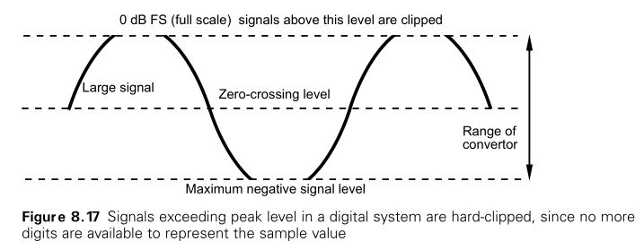

# Digial Audio

## Audio sampling

An analogue audio signal is a time-continuous electrical waveform and the A/D convertor’s task is to turn this signal into a time-discrete sequence of binary numbers. The sampling process employed in an A/D convertor involves the measurement or ‘sampling’ of the amplitude of the audio waveform at regular intervals in time (see Figure 8.7). From this diagram it will be clear that the sample pulses represent the instantaneous amplitudes of the audio signal at each point in time. 

### Filtering and aliasing

 few samples are taken per cycle of the audio signal then the samples may be interpreted as representing a wave other than that originally sampled. This is one way of understanding the phenomenon known as aliasing. An ‘alias’ is an unwanted representation of the original signal that arises when the sampled signal is reconstructed during D/A conversion.

Before modulation the audio signal has a frequency spectrum extending over the normal audio range, known as the baseband spectrum (upper diagram).The shape of the waveform and its equivalent spectrum is not significant in this diagram – it is just an artist’s impression of a complex audio signal such as music.The sampling pulses, before modulation, have a line spectrum at multiples of the sampling frequency, which is much higher than the highest audio frequency (middle diagram).The frequency spectrum of the pulse-amplitude-modulated (PAM) signal is as shown in the lower diagram. In addition to the ‘baseband’ audio signal (the original audio spectrum before sampling) there are now a number of additional images of this spectrum, each centred on multiples of the sampling frequency. Sidebands have been produced either side of the sampling frequency and its multiples, as a result of the amplitude modulation, and these extend above and below the sampling frequency and its multiples to the extent of the base bandwidth. In other words these sidebands are pairs of mirror images of the audio baseband.

It is relatively easy to see why the sampling frequency must be at least twice the highest baseband audio frequency from picture below. It can be seen that an extension of the baseband above the Nyquist frequency results in the lower sideband of the first spectral repetition overlapping the upper end of the baseband and appearing within the audible range that would be reconstructed by a D/A convertor. Two further examples are shown to illustrate the point – the first in which a baseband tone has a low enough frequency for the sampled sidebands to lie above the audio frequency range, and the second in which a much higher frequency tone causes the lower sampled sideband to fall well within the baseband, forming an alias of the original tone that would be perceived as an unwanted component in the reconstructed audio signal.

The aliasing phenomenon can be seen in the case of the well-known ‘spoked-wheel’ effect on films, since moving pictures are also an example of a sampled signal. In film, still pictures (image samples) are normally taken at a rate of 24 per second. If a rotating wheel with a marker on it is filmed it will appear to move round in a forward direction as long as the rate of rotation is much slower than the rate of the still photographs, but as its rotation rate increases it will appear to slow down, stop, and then appear to start moving backwards. one would arrange to filter out moving objects that were rotating faster than half the frame rate of the film.

In basic convertors, therefore, it is necessary to filter the baseband audio signal before the sampling process, as shown on the picture below, so as to remove any components having a frequency higher than half the sampling frequency. It is therefore clear that in practice the choice of sampling frequency governs the high frequency limit of a digital audio system.

In real systems, and because filters are not perfect, the sampling frequency is usually made higher than twice the highest audio frequency to be represented, allowing for the filter to roll off more gently. The filters incorporated into both D/A and A/D convertors have a pronounced effect on sound quality, since they determine the linearity of the frequency response within the audio band, the slope with which it rolls off at high frequency and the phase linearity of the system. In a non-oversampling convertor, the filter must reject all signals above half the sampling frequency with an attenuation of at least 80 dB. Steep filters tend to have an erratic phase response at high frequencies and may exhibit ‘ringing’ due to the high ‘Q’ of the filter. Steep filters also have the added disadvantage that they are complicated to produce. Although filter effects are unavoidable to some extent, manufacturers have made considerable improvements to analogue antialiasing and reconstruction filters and these may be retro-fitted to many existing systems with poor filters. A positive effect is normally noticed on sound quality.

The process of oversampling and the use of higher sampling frequencies (see below) has helped to ease the problems of such filtering. Here the first repetition of the baseband is shifted to a much higher frequency, allowing the use of a shallower anti-aliasing filter and consequently fewer audible side effects.

### Sampling frequency and sound quality

The choice of sampling frequency determines the maximum audio bandwidth available. There is a strong argument for choosing a sampling frequency no higher than is strictly necessary, in other words not much higher than twice the highest audio frequency to be represented.

Picture below shows commonly encountered sampling frequencies.

Doubling the sampling frequency leads to a doubling in the overall data rate of a digital audio system and a consequent halving in storage time per megabyte. It also means that any signal processing algorithms need to process twice the amount of data and alter their algorithms accordingly. It follows that these higher sampling rates should be used only after careful consideration of the merits.

### Quantising

After sampling, the modulated pulse chain is quantised. In quantising a sampled audio signal the range of sample amplitudes is mapped onto a scale of stepped binary values, as shown on the picture below. 

Quantising error is an inevitable side effect in the process of A/D conversion and the degree of error depends on the quantising scale used.  The more bits, the more accurate the process of quantisation.

- 4 bit scale offers 16 possible steps
- 8 bit scale offers 256 steps
- 16 bit scale 65 536

The quantising error magnitude will be a maximum of plus or minus half the amplitude of one quantising step and a greater number of bits per sample will therefore result in a smaller error, provided that the analogue voltage range represented remains the same.

The picture below shows the binary number range covered by digital audio signals at different resolutions using the usual two’s complement hexadecimal representation. It will be seen that the maximum positive sample value of a 16 bit signal is &7FFF, whilst the maximum negative value is &8000. The sample value changes from all zeros (&0000) to all ones (&FFFF) as it crosses the zero point. The maximum digital signal level is normally termed 0 dBFS (FS = full scale).

__serial or parallel__

Electrically it is possible to represent the quantised binary signal in either serial or parallel form. 

When each bit of the audio sample is carried on a separate wire, the signal is said to be in a parallel format, so a 16 bit convertor would have 16 single bit outputs. If the data is transmitted down a single wire or channel, one bit after the other, the data is said to be in serial format. In serial communication the binary word is clocked out one bit at a time using a device known as a shift register.The shift register is previously loaded with the word in parallel form as shown in the diagram.The rate at which the serial data is transferred depends on the rate of the clock. 

Serial form is most useful for transmission over interconnects or transmission links that might cover substantial distances or where the bulk and cost of the interconnect limits the number of paths available. Parallel form tends to be used internally, within high speed digital systems, although serial forms are increasingly used here as well. Most digital audio interfaces are serial, for example, although the Tascam TDIF interface uses a parallel representation of the audio data.

### Quantising resolution and sound quality

The quantising error may be considered as an unwanted signal added to the wanted signal, as shown on the picture below. Unwanted signals tend to be classified either as distortion or noise, depending on their characteristics, and the nature of the quantising error signal depends very much upon the level and nature of the related audio signal. 

__Dynamic range and perception__

It is possible with digital audio to approach the limits of human hearing in terms of sound quality. In other words, the unwanted artefacts of the process can be controlled so as to be close to or below the thresholds of perception. It is also true, though, that badly engineered digital audio can sound poor and that the term ‘digital’ does not automatically imply high quality.The choice of sampling parameters and noise shaping methods, as well as more subtle aspects of convertor design, affect the frequency response, distortion and perceived dynamic range of digital audio signals.

The human ear’s capabilities should be regarded as the standard against which the quality of digital systems is measured, since it could be argued that the only distortions and noises that matter are those that can be heard. Work carried out by Louis Fielder and Elizabeth Cohen attempted to establish the dynamic range requirements for high quality digital audio systems by investigating the extremes of sound pressure available from acoustic sources and comparing these with the perceivable noise floors in real acoustic environments. Using psychoacoustic theory, Fielder was able to show what was likely to be heard at different frequencies in terms of noise and distortion, and where the limiting elements might be in a typical recording chain. 

He determined a dynamic range requirement of 122 dB for natural reproduction.Taking into account microphone performance and the limitations of consumer loudspeakers, this requirement dropped to 115 dB for consumer systems.

The dynamic range of a digital audio system is limited at high signal levels by the point at which the quantising range of the convertor has been ‘used up’ (in other words, when there are no more bits available to represent a higher level signal). At this point the waveform will be hard clipped (see picture below) and will become very distorted. This point will normally be set to occur at a certain electrical input voltage, such as +24 dBu in some professional systems. 

The number of bits per sample therefore dictates the signal-to-noise ratio of a linear PCM digital audio system. The picture below summarises the applications for different quantising resolutions.

- This is the CD standard and is capable of offering a good S/N ratio range of over 90 dB. 
- A/D resolution of around 21 bits, to reach the psychoacoustic ideal of 122 dB for subjectively noise-free reproduction in professional systems
- 24 bit convertors are indeed available today, but their audio performance is strongly dependent upon the stability of the timing clock, electrical environment, analogue stages, grounding and other issues.

__head-room__ - – in other words some unused dynamic range above the normal peak recording level which can be used in unforeseen circumstances such as when a signal overshoots its expected level. This can be particularly necessary in live recording situations where one is never quite sure what is going to happen with recording levels. This is another reason why many professionals feel that a reso-
lution of greater than 16 bits is desirable for original recording.

Twenty and 24 bit recording formats are becoming increasingly popular for this reason, with mastering engineers then optimising the finished recording for 16 bit media (such as CD) using noise-shaped requantising processes.

### Dither in A/D conversion

The use of dither in A/D conversion, as well as in conversion between one sample resolution and another, is now widely accepted as correct. It has the effect of linearising a normal convertor (in other words it effectively makes each quantising interval the same size) and turns quantising distortion into a random, noise-like signal at all times. 

- white noise at a very low level is less subjectively annoying than distortion
- it allows signals to be faded smoothly down without the sudden disappearance noted above
- it allows signals to be reconstructed even when their level is below the noise floor of the system
- Undithered audio signals begin to sound ‘grainy’ and distorted as the signal level falls

### Oversampling in A/D conversion

Oversampling involves sampling audio at a higher frequency than strictly necessary to satisfy the Nyquist criterion. 

Although oversampling A/D convertors often quote very high sampling rates of up to 128 times the basic rates of 44.1 or 48 kHz, the actual rate at the digital output of the convertor is reduced to a basic rate or a small multiple thereof (e.g. 48, 96 or 192 kHz). Samples acquired at the high rate are quantised to only a few bits’ resolution and then digitally filtered to reduce the sampling rate, as shown on picture below. 

The digital low-pass filter limits the bandwidth of the signal to half the basic sampling frequency in order to avoid aliasing, and this is coupled with ‘decimation’. Decimation reduces the sampling rate by dropping samples from the oversampled stream. A result of the low-pass filtering operation is to increase the word length of the samples very considerably.

Oversampling brings with it a number of benefits and is the key to improved sound quality at both the A/D and D/A ends of a system. Because the initial sampling rate is well above the audio range (often tens or hundreds of times the nominal rate) the spectral repetitions resulting from PAM are a long way from the upper end of the audio band (see picture below). The analogue anti-aliasing filter used in conventional convertors is replaced by a digital decimation filter. 

Such filters can be made to have a linear phase response if required, resulting in higher sound quality. If oversampling is also used in D/A conversion the analogue reconstruction filter can have a shallower roll-off. This can have the effect of improving phase linearity within the audio band, which is known to improve audio quality. In oversampled D/A conversion, basic rate audio is up-sampled to a higher rate before conversion and reconstruction filtering. Oversampling also makes it possible to introduce so-called ‘noise shaping’ into the conversion process, which allows quantising noise to be shifted out of the most audible parts of the spectrum.

### D/A conversion

The basic D/A conversion process is shown on the picture below. 

Audio sample words are converted back into a staircase-like chain of voltage levels corresponding to the sample values. This is achieved in simple convertors by using the states of bits to turn current sources on or off, making up the required pulse amplitude by the combination of outputs of each of these sources. This staircase is then
‘resampled’ to reduce the width of the pulses before they are passed through a low-pass reconstruction filter whose cut-off frequency is half the sampling frequency. The effect of the reconstruction filter is to join up the sample points to make a smooth waveform. Resampling is necessary to avoid any discontinuities in signal amplitude at sample boundaries and because otherwise the averaging effect of the filter would result in a reduction in the amplitude of high-frequency audio signals (the so-called ‘aperture effect’). Aperture effect may be reduced by limiting the width of the sample pulses to perhaps one-eighth of the sample period. Equalisation may be required to correct for aperture effect.

### Rotary Head Digital Recorders

The rotary head recorder has the advantage that the spinning heads create a high head-to-tape speed, offering a high bit rate recording without high linear tape speed. Picture below shows a representative block diagram of a rotary head machine. Following the convertors, a compression process may be found. In an uncompressed recorder, there will be distribution of odd and even samples for concealment purposes. An interleaved product code will be formed prior to the channel coding stage, which produces the recorded waveform. 

